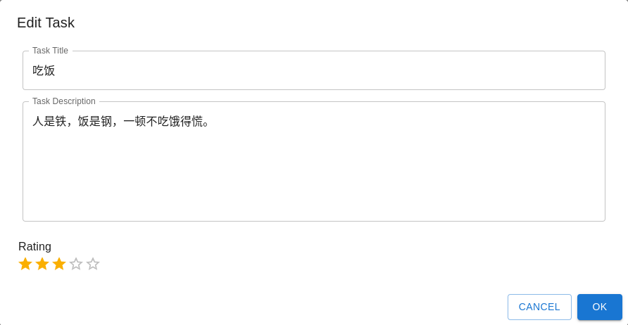
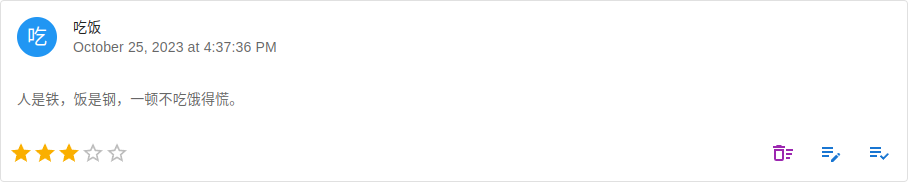

# Usage - 使用说明

## Add Task - 添加任务

1. Click the add button - 点击添加按钮  

2. Edit the task title, description and rating - 编辑任务标题、描述和等级  

3. Click the OK button - 点击 OK 按钮  

## Mark Task Done - 完成任务

1. Select TO DO tab - 进入 TO DO 分页  

2. Find the task card - 找到任务卡片  

3. Click the done button - 点击完成按钮  

## Mark Task GiveUp - 放弃任务

1. Select TO DO tab - 进入 TO DO 分页  

2. Find the task card - 找到任务卡片  

3. Click the give-up button - 点击放弃按钮  

## Redo Task - 重做任务

1. Select DONE or GIVE UP tab - 进入 DONE 或 GIVE UP 分页  

2. Find the task card - 找到任务卡片  

3. Click the redo button - 点击重做按钮  

## Delete Task 删除任务

1. Select DONE or GIVE-UP tab - 进入 DONE 或 GIVE UP 分页  

2. Find the task card - 找到任务卡片  

3. Click the delete button - 点击删除按钮  

## Edit Task - 编辑任务

1. Select TO DO, DONE or GIVE UP tab - 进入 TODO, DONE 或 GIVE UP 分页   

2. Find the task card - 找到任务卡片  

3. Click the edit button - 点击编辑按钮  

4. Edit the task title, description and rating - 编辑任务标题、描述和等级  

5. Click the OK button - 点击 OK 按钮  

## Data Synchronization - 数据同步

**Export** :  

1. Find the navigation - 找到导航栏  

2. Click the sync button - 点击同步按钮  

3. Wait ready - 等待就绪  

4. Copy the ID - 复制 ID  

**Import**: 

1. Find the navigation - 找到导航栏  

2. Click the sync button - 点击同步按钮  

3. Wait for ready - 等待就绪  

4. Input the ID - 输入 ID  

5. Click the import button - 点击导入按钮  

6. Wait for completion - 等待完成  
